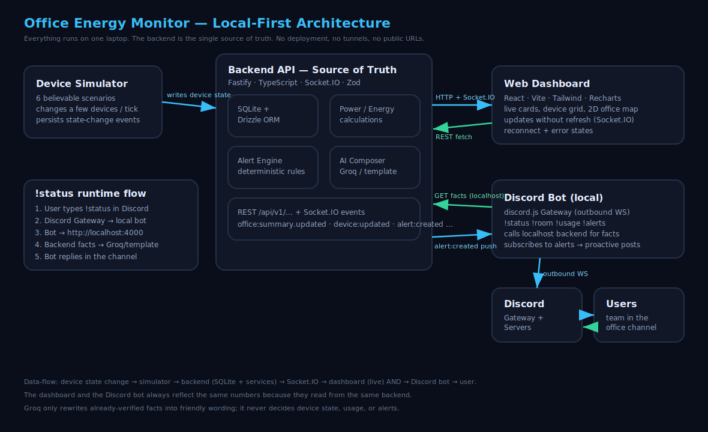
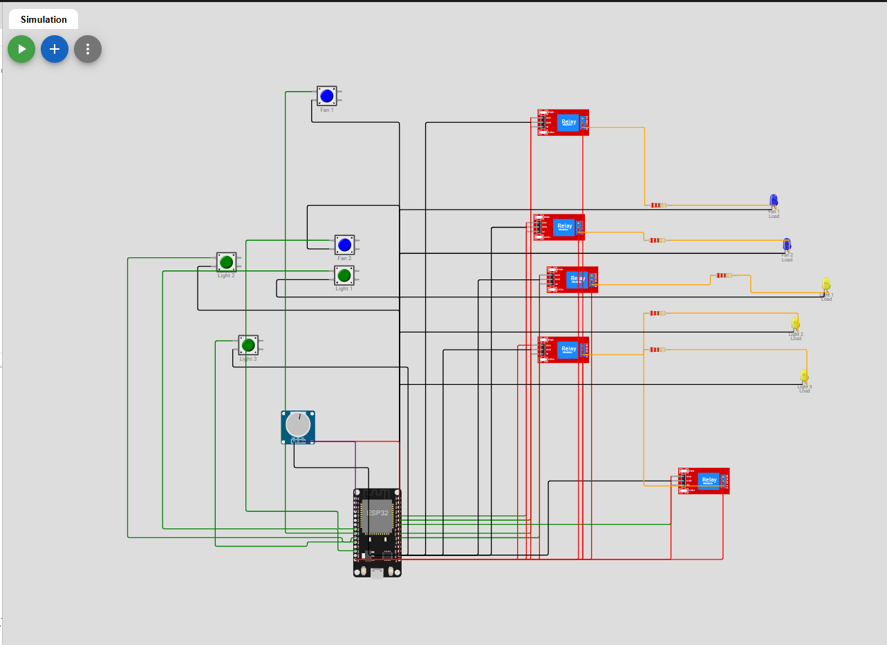

# ⚡ Office Energy Monitor by Team RAGKorla

Office Energy Monitor system that monitors office lights and fans, calculates power usage, detects energy waste, and displays everything on a **real-time web dashboard**.
It includes a **Discord bot** for querying office status, all powered by a single shared backend running entirely on a single laptop.


## ✨ Key Features

* **Live Dashboard:** Features summary cards, a device grid by room, a 2D office map (lights glow, fans spin), a power-history chart, and timestamped alerts that update without refreshing.
* **Discord Bot:** Supports commands like `!status`, `!room <name>`, `!usage`, and `!alerts`, plus proactive alert posts.
* **Shared Source of Truth:** The frontend never invents device state, and the bot never calculates independently. Both read from the exact same backend (SQLite + domain services).
* **Friendly Wording via Groq:** Groq acts as a backend-only tool to rewrite verified facts. If no API key is provided, a deterministic template fallback ensures the system works perfectly offline.

---

## 🏗 Architecture & Tech Stack

* **Backend:** Node.js, TypeScript, Socket.IO, Zod, Pino, Drizzle ORM + better-sqlite3, Vitest.
* **Frontend:** React, Vite, TypeScript, Tailwind, TanStack Query, Socket.IO client, Recharts, Framer Motion.
* **Discord Bot:** discord.js (Gateway mode), TypeScript.
* **LLM ():** `groq-sdk` (backend-only).



### Hardware Circuit Diagram



Hardware simulation files:

* [Wokwi diagram JSON](docs/hardware/diagram.json)
* [ESP32 Arduino sketch](docs/hardware/sketch.ino)

### Monorepo Layout

```text
backend/       Fastify API, simulator, alert engine, SQLite, Groq/template composer
frontend/      React dashboard + 2D office map
discord-bot/   discord.js bot (prefix commands + proactive alerts)
docs/          architecture SVG, wiring guide + Wokwi files, API docs, demo script

```

---

## 🚀 Quick Start

### Prerequisites

* **Node.js 20+** and **npm 10+**
* A Discord bot token (for the bot)
* A Groq API key 
### 1. Installation

The root install command sets up all three workspaces. You can also use `pnpm install`.

```bash
npm install

```

### 2. Environment Variables

Create the `.env` files for each workspace. Copy the configurations below into their respective `.env` files. *(Note: Never commit real API keys to version control).*

**`backend/.env`**

```env
PORT=4000
HOST=0.0.0.0
DATABASE_URL=file:./local.db
NODE_ENV=development

# Office hours used by the after-hours alert rule (24h clock, local time)
OFFICE_START_HOUR=9
OFFICE_END_HOUR=2

# Simulator tick interval in milliseconds
SIMULATOR_INTERVAL_MS=30000
SIMULATOR_AUTOSTART=true

# High-room-usage alert threshold in watts (optional)
HIGH_ROOM_WATT_THRESHOLD=250

# CORS origin for the dashboard
CORS_ORIGIN=http://localhost:5173

# --- Groq (optional). Leave blank to use deterministic template wording. ---
# Never commit real values. Empty keys are ignored.

GROQ_API_KEY_1=

GROQ_MODEL=llama-3.3-70b-versatile
GROQ_TIMEOUT_MS=4000


```

**`frontend/.env`**

```env
VITE_API_URL=http://localhost:4000
VITE_SOCKET_URL=http://localhost:4000

```

**`discord-bot/.env`**

```env

# Discord bot token from the Developer Portal (Bot -> Reset Token).
# Enable the "Message Content Intent" toggle — prefix commands read message text.
DISCORD_BOT_TOKEN=your_discord_bot_token_here
DISCORD_CLIENT_ID=your_discord_client_id_here
DISCORD_GUILD_ID=your_discord_guild_id_here

# Channel where proactive alert messages are posted.
DISCORD_ALERT_CHANNEL_ID=your_discord_alert_channel_id_here

# Command prefix
COMMAND_PREFIX=!

# Shared local backend (never public, never tunneled)
BACKEND_API_URL=http://localhost:4000
BACKEND_SOCKET_URL=http://localhost:4000

```

### 3. Run the Services

Open three separate terminals and run the following commands:

```bash
npm run dev:backend     # Starts API (simulator auto-starts + seeds DB)
npm run dev:frontend    # Starts React dashboard
npm run dev:bot         # Connects outward to Discord (requires token)

```

*The database file (`backend/local.db`) is created and seeded automatically on the first run. To re-seed manually, run `npm run seed`.*

### Expected Local URLs

| Service | URL |
| --- | --- |
| **Dashboard** | http://localhost:5173 |
| **Backend API** | http://localhost:4000 |
| **SQLite DB** | `backend/local.db` (file) |
| **Discord Bot** | Connects outward to Discord Gateway (no local URL) |

---

## 🤖 Discord Bot Commands

The bot uses **Gateway mode only** (outbound WebSocket). It ignores other bots, handles backend downtime gracefully, and requires no webhooks or tunnels.

* `!status` : Whole-office summary.
* `!room <name>` : Details for a specific room (Aliases supported: `work1`, `room1`, `drawing`, etc.).
* `!usage` : Total watts, today's kWh, highest room, and a short insight.
* `!alerts` : Active alerts with timestamps.

---

## 🚨 Alert Engine (Deterministic Backend Logic)

Alerts are deduplicated to prevent spam, auto-resolved when the condition clears, and safely persisted. **Groq is never used to determine if an alert exists.**

1. **After-hours waste:** Flags devices still ON outside configured office hours (default 9:00–17:00). Details room, active count, watts, and time.
2. **Room overactive:** Triggers if *all* devices in a room are ON continuously for **> 2 hours**. Auto-resolves.
3. **High room usage:** Triggers if a room's wattage exceeds the `HIGH_ROOM_WATT_THRESHOLD` (default 250 W).

---

## 📊 Device Count Configuration

The office contains **15 devices total** (3 rooms × [2 fans + 3 lights]).

* This is the confirmed, authoritative count.
* The system seeds 15 devices and **never hardcodes any device count** into the business logic.
* Every metric (total devices, per-room counts, watt sums) is derived dynamically from the database, ensuring the layout remains entirely configurable.
* The seeded layout is located in `backend/src/shared/constants.ts`.

---

## 🧪 Testing & Documentation

Verify a workspace by running: `npm run typecheck` · `npm run lint` · `npm run build`.

```bash
npm test                           # Run all workspace tests
npm test --workspace backend       # Test power, energy, alert rules, simulator, groq fallback
npm test --workspace discord-bot   # Test room alias resolution

```

**API & Realtime Events:**
For full reference, see `docs/api-documentation.md`. Key endpoints include:

* `GET /health`
* `GET /api/v1/office/summary`
* `GET /api/v1/energy`
* `GET /api/v1/alerts`
* Socket.IO events: `office:summary.updated`, `alert:created`
